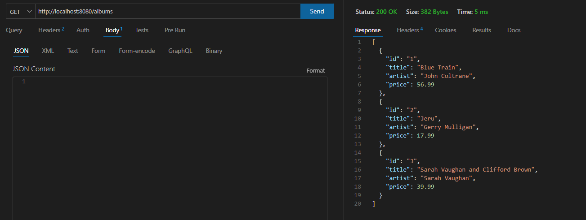

# API REST GO WITH GIN
con gin Go

https://gin-gonic.com/docs/quickstart/

comando: 
go get -u github.com/gin-gonic/gin

para ver constantes de l http :https://pkg.go.dev/net/http#pkg-constants

  

  

